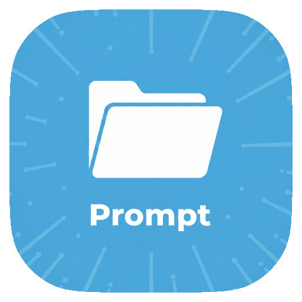

# 📝 Prompt Manager for Raycast

Manage your AI prompt library with lightning speed directly from Raycast. Save, organize, and generate professional prompts using the power of Raycast AI.



## ✨ Features

- **🚀 Triple-Tool Architecture**: Three dedicated commands for every part of your workflow:
  - **Save Prompt**: A clean, manual form to store your existing prompts with support for tags and {{variables}}.
  - **View Prompts**: A powerful list to search, copy, edit, and manage your library.
  - **Generate Prompt (AI)**: An intelligent assistant that crafts optimized prompt templates from a simple description.
- **🤖 Powered by Raycast AI**: Effortlessly create high-quality prompt templates including titles, content, and relevant tags.
- **⚡ Pro-level UX**:
  - **Keyboard First**: Use `Cmd + E` to edit, `Cmd + N` to create, and `Enter` to copy.
  - **Safety First**: Confirmation alerts for destructive actions like deleting.
  - **Smart Persistence**: Powered by Zustand and Raycast's native LocalStorage for ultra-fast, offline-first performance.
- **🎨 Sophisticated Design**: Beautifully organized metadata, accessories, and clean Markdown rendering following Raycast's best practices.

## 🛠️ Installation

1. Clone this repository or copy the files to your local machine.
2. Ensure you have [Bun](https://bun.sh/) installed.
3. Install dependencies:
   ```bash
   bun install
   ```
4. Run in development mode:
   ```bash
   bun run dev
   ```
5. To build the extension:
   ```bash
   bun run build
   ```

## 📋 Commands

### 1. View Prompts
Your primary command for daily use.
- **Search** instantly through titles and content.
- **Copy** content to clipboard with a single hit of `Enter`.
- **Delete** with `Ctrl + X` (after confirmation).
- **Edit** with `Cmd + E`.

### 2. Save Prompt
Quick entry for your favorite templates.
- **Fields**: Title, Content (supports `{{placeholder}}`), and Tags (comma-separated).
- **Validation**: Ensures your templates are never empty.

### 3. Generate Prompt (AI)
Requires Raycast Pro (AI Access).
- **Process**: Describe your goal → AI creates magic → Review the result → Automatically saved to your library.
- **Robustness**: Handles AI responses gracefully with automatic JSON extraction and formatting.

## 🏗️ Technical Stack

- **Runtime**: [Bun](https://bun.sh/)
- **Language**: [TypeScript](https://www.typescriptlang.org/) (Advanced Types & Readonly interfaces)
- **Framework**: [React](https://reactjs.org/) (Raycast UI Kit)
- **State Management**: [Zustand](https://github.com/pmndrs/zustand) with Async Persistence middleware.
- **Storage**: [Raycast LocalStorage API](https://developers.raycast.com/api-reference/localstorage).

## 📄 License

This extension is licensed under the [MIT License](LICENSE).
